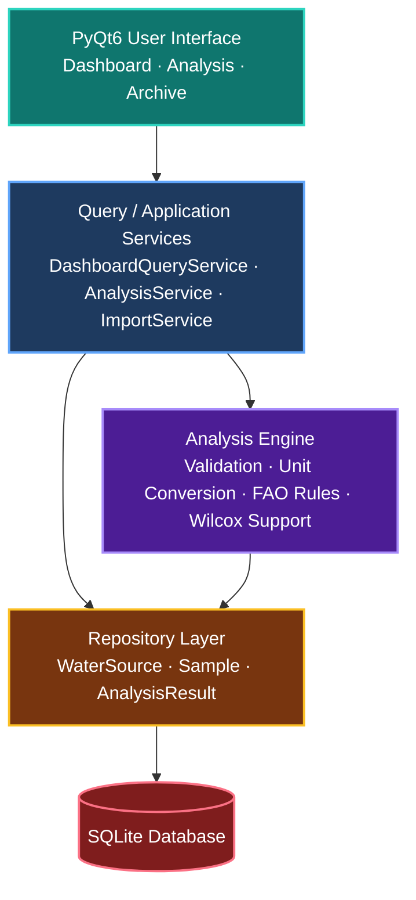
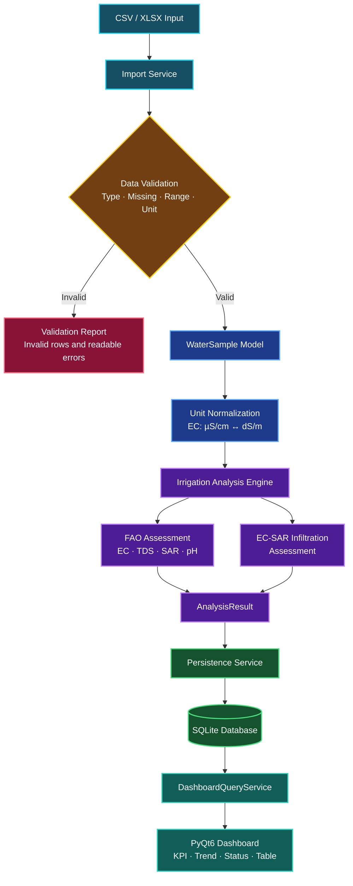
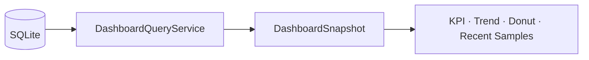

# Software Architecture

This document describes the active architecture and end-to-end processing flow of **Grovity Irrigation Water**.

---

## 1. Layered Application Architecture



### Layer responsibilities

| Layer | Location | Responsibility |
|---|---|---|
| Domain | `src/aqualog/domain` | Stable models, enums, and domain errors |
| Scientific core | `src/aqualog/core` | Validation, unit normalization, formulas, FAO/Wilcox rules, and overall assessment |
| Data | `src/aqualog/data` | CSV/XLSX import, SQLite schema, and repositories |
| Services | `src/aqualog/services` | Application workflows, seeding, and read models for the UI |
| UI | `src/aqualog/ui` | PyQt6 windows, pages, widgets, dialogs, charts, and RTL behavior |
| Fixtures | `data/fixtures/rfp` | Scientific reference data, boundary cases, and regression expectations |
| Tests | `tests` | Unit, regression, and integration coverage |

The UI does not execute raw SQL or scientific calculations directly. Application services coordinate use cases, the analysis engine remains independent from PyQt6, and repositories encapsulate persistence.

---

## 2. CSV/XLSX Import and Analysis Flow



### Processing sequence

1. `ImportService` reads CSV or XLSX input.
2. Input rows are checked for data type, missing values, accepted ranges, and units.
3. Invalid rows are excluded from scientific processing and returned as readable validation issues.
4. Valid rows are converted to `WaterSample` domain objects.
5. Units are normalized to the canonical internal representation.
6. The irrigation analysis engine evaluates the primary FAO rules.
7. EC–SAR infiltration risk is evaluated separately from the application-level overall status.
8. An `AnalysisResult` is generated.
9. Samples and analysis results are persisted through the repository layer.
10. `DashboardQueryService` prepares database data for the PyQt6 dashboard.

---

## 3. Scientific Boundary

The scientific engine accepts domain models and returns analysis models. It does not depend on PyQt6, pandas DataFrames, or SQLite.

Canonical units during analysis:

- EC → `dS/m`
- TDS → `mg/L`
- SAR → dimensionless
- pH → dimensionless
- Ionic chemistry → `meq/L`

The FAO EC–SAR infiltration result is intentionally preserved as a separate diagnostic. The green / amber / red application summary should not be described as an official FAO composite index.

---

## 4. Persistence

SQLite stores the primary runtime entities:

- `water_sources`
- `samples`
- `analysis_results`

Raw measurements are retained separately from derived analysis results. Analysis records also preserve the relevant engine/standard profile so historical outputs remain traceable.

The runtime SQLite file is intentionally excluded from version control. The bundled RFP fixture under `data/fixtures/rfp/` remains part of the repository and is used to initialize an empty application database.

---

## 5. Query Services

Dashboard and archive widgets do not query SQLite directly. Dedicated query services return UI-ready read models and coherent snapshots.

Typical dashboard flow:



This keeps data access outside the presentation layer and allows the dashboard to refresh atomically.

---

## 6. UI Architecture

The application uses a Persian right-to-left interface at the application level while preserving left-to-right presentation for scientific values, identifiers, dates, URLs, and units where appropriate.

Shared UI infrastructure lives under:

```text
src/aqualog/ui/theme/
src/aqualog/ui/widgets/
src/aqualog/ui/charts/
src/aqualog/ui/dialogs/
```

The application uses:

- `QMainWindow` for the application shell
- `QStackedWidget` for primary page navigation
- `QTableView` + model classes for tabular data
- PyQtGraph for scientific trend visualization
- custom widgets for KPI cards, status pills, donut charts, states, and notifications

---

## 7. First-Launch Data Initialization

The repository includes the prepared 300-record RFP dataset under:

```text
data/fixtures/rfp/
```

When the application starts with an empty local database, the seed service initializes:

- 20 water sources
- 300 samples
- 300 analysis results

The seed process is idempotent for a populated runtime database and does not intentionally duplicate the bundled records on every launch.

---

## 8. Design Principles

- Scientific logic remains independent from the GUI.
- Widgets never execute SQL directly.
- Scientific rules have a single source of truth.
- Validation occurs before scientific analysis and persistence.
- Unit normalization is explicit and testable.
- Raw measurements and calculated results are stored separately.
- Query services provide UI-oriented read models.
- Local SQLite storage allows offline execution.
- Bundled scientific fixtures make regression testing reproducible.
- Historical AquaLog code is kept only as documentation under `docs/legacy/aqualog/` and is not imported by active modules.
