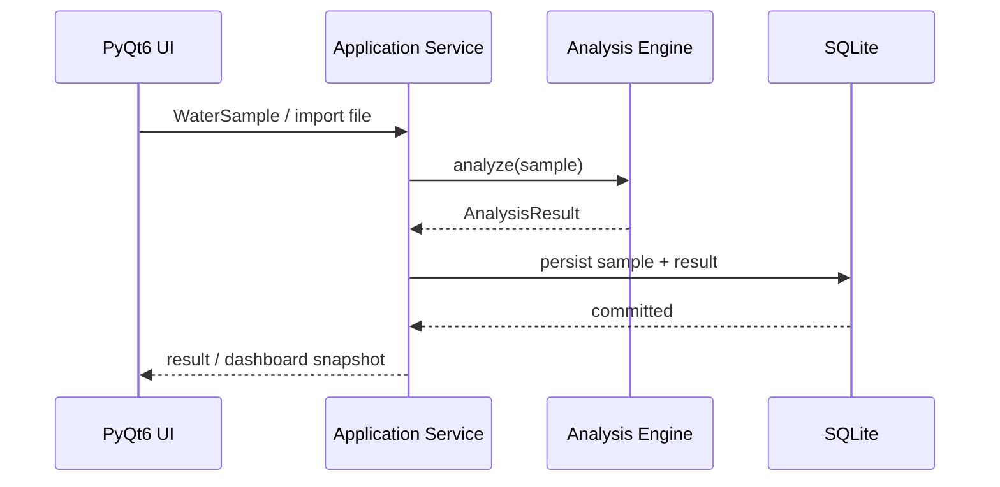

# Architecture

## Purpose

This document describes the active architecture of **Grovity Irrigation Water**. The application is organized so that the scientific engine, persistence layer, and PyQt6 interface can evolve independently.

## Layer Map

| Layer | Location | Responsibility |
|---|---|---|
| Domain | `src/aqualog/domain` | Stable models, enums, and domain errors |
| Scientific core | `src/aqualog/core` | Validation, unit normalization, formulas, FAO/Wilcox rules, overall assessment |
| Data | `src/aqualog/data` | CSV/Excel import, SQLite schema, repositories |
| Services | `src/aqualog/services` | Application workflows and read models for the UI |
| UI | `src/aqualog/ui` | PyQt6 windows, pages, widgets, dialogs, charts, RTL behavior |
| Fixtures | `data/fixtures/rfp` | Scientific reference data and regression expectations |
| Tests | `tests` | Unit, regression, and integration coverage |

## Runtime Flow



## Scientific Boundary

The scientific engine accepts domain models and returns analysis models. It does not depend on PyQt6, pandas DataFrames, or SQLite.

Canonical units used during analysis:

- EC → `dS/m`
- TDS → `mg/L`
- SAR → dimensionless
- pH → dimensionless
- ionic chemistry → `meq/L`

The FAO EC–SAR infiltration result remains a separate diagnostic. The application-level overall status summarizes the four primary project inputs and should not be described as an official FAO composite index.

## Persistence

SQLite contains three primary entities:

- `water_sources`
- `samples`
- `analysis_results`

Raw user-entered values are retained in `samples`. Derived analysis results are stored separately with the analysis version/profile so historical results remain traceable.

## Query Services

The dashboard and archive use dedicated query services rather than querying SQLite from widgets. This keeps UI state coherent and makes the presentation layer easier to test.

## UI Architecture

The interface is RTL at application level, with deliberate physical LTR containers where Qt mirroring would otherwise place controls incorrectly. Persian labels remain RTL; scientific values, IDs, dates, URLs, and units use LTR alignment where appropriate.

Shared visual behavior lives under:

```text
src/aqualog/ui/theme/
src/aqualog/ui/widgets/
src/aqualog/ui/rtl_layout.py
```

Inline styling is kept to cases where a custom-painted or local interaction state requires it.

## Legacy Reference

The original AquaLog code reviewed during the initial migration is archived under `docs/legacy/aqualog`. It is kept only as historical reference and must not be imported by active application modules.
